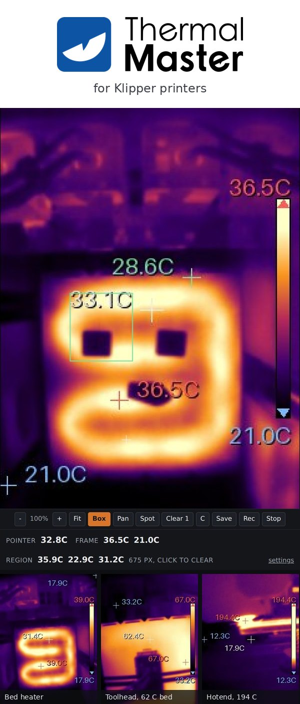

# thermal-master



This is [`Bespok3d/B3_ThermalMaster`](https://github.com/Bespok3d/B3_ThermalMaster)[^name], the
home of the `thermal-master` plugin. It was `Mauker1/B3_ThermalMaster_P1_P3` until 2026-09-28, and
GitHub redirects the old address.

The Bespok3d **Thermal Master** plugin for the Snapmaker U1: streams an InfiRay-OEM Thermal Master
**P1 or P3** USB thermal camera, so you can watch a print thermally in Fluidd or Mainsail with no
UVC, no firmware flashing, and no Rockchip MPP dependency. Plug either one in; the plugin works out
which it is from the USB product ID and drives both from the same code path.

Neither camera is a UVC/V4L2 device. They speak a vendor protocol over raw USB bulk transfers, so
the kernel's `uvcvideo` driver never claims them and the camera-hw-accel V4L2 pipeline cannot see
them. This plugin drives the camera directly over libusb (pyusb), colourmaps the 16-bit thermal
frame, draws a temperature readout into it, and serves the result as ordinary MJPEG. The whole
capture path is pure Python; there is no arm64 build toolchain.

It also serves an interactive viewer at `/thermal/view`: point at the picture to read the
temperature there, drag a box to measure a region, place spot markers, save a still or record a
clip, and hold the display range so a colour means the same thing in every frame. And it can
record a thermal timelapse of every print, one frame per layer, made into a clip on the printer
once the print has ended (ROADMAP Phase 9). The plugin's own documentation,
[`plugin/doc/README.md`](plugin/doc/README.md), shows the six palettes and lists every setting,
with the JSON endpoint that changes them.

**What it costs the printer**, measured on the hardware with
`scripts/measure-cpu-on-printer.sh`, as a share of one of the U1's four Cortex-A53 cores:

| state | cost |
| --- | --- |
| camera switched off | 0.0% |
| nothing watching | 4.6% |
| a dashboard tile visible | 41.9% |
| the viewer open, pointer moving | 45.7% |

That was not free. It was 62.5% before the rendering pipeline was profiled and 40.6% at rest before
the plugin learned to stop working when nobody is looking. Sections 5 and 7g of
[ROADMAP.md](ROADMAP.md) are the record of how it got here, and since 0.25.0 the plugin reports its
own share on its settings page rather than making anybody measure it.

It is a worked example of a libusb-based (non-V4L2) camera plugin. For the concepts see the
Bespok3d docs: `doc/anatomy-of-a-plugin.md`, `doc/package-format.md`.

## Sponsorship

Thermal Master supports this project with hardware and an affiliate arrangement. It does not fund
it, and it does not buy any of the technical content. The performance figures above are measurements
taken from a printer, the hardware status section still says plainly that the P3 has never been in
front of one, and anything that stops being true about either camera gets written here whatever the
arrangement is.

### Where to buy a P1

If you are buying one and want the project to benefit, buy it through the shop link below. It costs
you nothing extra, and the discount code applies there.

| | |
| --- | --- |
| Official shop | https://thermalmaster.com/BESPOKD |
| Discount code | `THERMALYML01`, at that shop |

Before buying a P3, read the [hardware status](#hardware-status) below. The plugin drives it from the same code path and
the same driver model config, and it has never been in front of one.

Disclosure: the shop link is an affiliate link, so the project earns a commission on purchases made
through it, at no extra cost to you.

## Layout

```text
plugin/
  manifest.json          metadata + install directives (single source of truth)
  requirements.txt       the three runtime dependencies, pinned
  files/bin/             thermal-master-stream.py: the service entry point, and nothing else
  files/lib/             thermal_master/: the plugin itself, as an importable package
  files/etc/nginx/       the reverse proxy that publishes the plugin under /thermal/
  files/vendor/          p3_camera.py, the vendored USB protocol driver (VENDORING.md)
  files/wheels/          BAKE OUTPUT, gitignored: the arm64 wheels the daemon installs
  files/webcam.conf.tmpl the [webcam] fragment that registers the camera with Moonraker
  doc/                   onboard docs rendered in the app, plus the changelog
  tests/                 the test suite, run against a stand-in camera rather than hardware
scripts/
  check.sh               the gate: pytest, ruff, mypy, and the repo's own rules
  check-in-browser.py    drives both pages in a real browser; not in the gate, needs playwright
  fetch-vendor.sh        verify the vendored driver still matches its pin, in both directions
  measure-cpu-on-printer.sh   what the plugin costs, read from the kernel over ssh
  profile-on-printer.sh       where the time inside a frame goes, measured on the printer
  refresh-facade.py      keep the package facade in step with what the modules export
  tag_version_guard.sh   refuse a release tag whose version the manifest does not declare
plugin/tests/run.sh          the tests as CI runs them, without the gate's private submodule
.github/workflows/release.yml   CI on a release tag: bake, test, pack, sign, release, register
.github/workflows/tests.yml     CI on every pull request and branch push: the tests, no secrets
```

The entry script is a name and a `sys.path` and nothing else. `thermal-master-stream` is a legal
program name and an illegal module name, so nothing can import it and mypy cannot derive a module
name for it either, which is why for a long time none of this code was type checked (ROADMAP F-47).
The code lives in `files/lib/thermal_master/` and is checked like any other package.

## Vendored upstream

The USB protocol layer is **not** reimplemented here. `plugin/files/vendor/p3_camera.py` is checked
in verbatim at a pinned commit, with its sha256 and the update procedure in
[VENDORING.md](VENDORING.md), from
[jvdillon/p3-ir-camera](https://github.com/jvdillon/p3-ir-camera) (Apache-2.0). Protocol
reverse-engineering credit: @aeternium. See `NOTICE`. What this repo adds on top is the rendering
pipeline, the temperature readout, the two pages and the service around them, all in
`files/lib/thermal_master/`.

The driver is pinned and is not ours to edit. Where it is wrong for a P1, the plugin works around it
rather than patching it: `trigger_shutter` reads back the frame that follows a calibration using
offsets measured on a P3, which on a 160 wide sensor point past the end of the frame buffer, so the
plugin sends the calibration command itself. That is reported upstream and written up in the
roadmap.

`numpy`, `Pillow` and `pyusb` are declared in `plugin/requirements.txt`. The build downloads them as
arm64 wheels into `files/wheels/`, and the daemon installs them on the printer into a virtual
environment belonging to this plugin alone, so nothing lands in the shared daemon venv and the
broken-pip situation on the U1 never comes up. `pyusb` needs `libusb-1.0.so.0`, which is present on
the U1 at 1.0.3.0.

## Build locally

Requires Node.js 20+. The builder is installed into its own prefix, never through `npx`, which
resolves to whatever copy npm cached earlier and silently builds against an out of date manifest
schema:

```sh
npm install --prefix ~/.b3-builder github:Bespok3d/b3-builder
~/.b3-builder/node_modules/.bin/b3-builder build \
  --source ./plugin --out dist --atom-repo Bespok3d/B3_ThermalMaster --bake
```

`--bake` downloads the arm64 wheels for `plugin/requirements.txt` into `plugin/files/wheels/`. It is
not optional: the builder refuses to pack a plugin that declares Python dependencies with an empty
wheels directory, rather than shipping something that cannot start on the printer.

To check the vendored driver still matches its pin, in both directions:

```sh
sh scripts/fetch-vendor.sh
```

## The gate

`scripts/check.sh` is what has to pass before anything is committed: pytest, ruff, mypy, shellcheck,
and the repo's own rules about release triggers, manifest origin, workflow pinning and dashes. It
lives partly in the `lib_bespok3d` submodule, so check that out first:

```sh
git submodule sync --recursive && git submodule update --init --recursive
bash scripts/check.sh
```

`lib_bespok3d` is private to the Bespok3d organisation, so a clone from outside it has no gate.
`sh plugin/tests/run.sh` runs the test suite on its own, which is also what CI runs on every pull
request.

Both pages are the part the test suite cannot really exercise, and both have shipped defects that
were invisible from Python and obvious to a browser. After touching either one:

```sh
pip install playwright && playwright install chromium
python3 scripts/check-in-browser.py
```

## Releasing

A release is published by a version tag and by nothing else. Bump `version` in
`plugin/manifest.json`, set `updated_at` to the release date (the builder does not stamp it, and
`published_at` stays at the first release's), commit it, push the branch, and then push a tag of the form
`plugin-thermal-master-v<version>` naming the same number. `scripts/tag_version_guard.sh` refuses a
tag whose version the manifest does not declare, and refuses anything that is not a release tag at
all, so a run off a branch cannot publish. CI then bakes the wheels, runs the tests, packs and signs
the `.b3`, publishes a GitHub release with it, and registers the list in the org's index.

**Signing.** Packages are signed with the Bespok3d organisation's key, whose fingerprint the signing
step stamps into the packed manifest in place of `"publisher": "PLACEHOLDER"`. The key and the index
token are organisation secrets, `REGISTRY_SIGNING_KEY` and `MAIN_INDEX_TOKEN`, which this public
repository reads by name; neither is ever written into a file here, and neither is needed to build
locally. Only maintainers can push a `plugin-*` tag, because anyone who can push one publishes a
package carrying the organisation's signature.

## Hardware status

Run end to end on a U1 with a **P1** attached since 0.2.2, continuously: every release since then,
in `CHANGELOG_DEV.md` and `plugin/doc/CHANGELOG.md`, has been confirmed on the maintainer's
printer, and the performance figures above and in the roadmap are measurements from it rather than
estimates. The camera tile renders in Fluidd and Mainsail, the control page and the viewer both work
in a dashboard tile, the settings survive a restart, and an unplug and replug recovers on its own.

It has also run on a second Klipper printer, an Ender 2 Pro Max on a Raspberry Pi 4 with Debian 12,
started by hand rather than through Bespok3d, on 2026-09-29: the same wheels the U1 package ships
installed there, the camera connected, the viewer worked, and a replug recovered. With the viewer
open and the pointer moving it cost 36.4% of one Cortex-A72 core against the U1's 45.7%, a
dashboard tile 37.5% against 41.9%, nothing watching 4.1% against 4.6%, and off 0.1% against 0.0%.
ROADMAP section 9 has the details.

The **P3** is driven by the same code path, the same protocol and the same driver model config, and
has never been in front of one. The sensor is 256x192 against the P1's 160x120, which the plugin
reads from the driver rather than assuming. If you have a P3, it should work, and a report either
way is welcome.

`plugin/doc/README.md` is the documentation that ships inside the package and is rendered in the
app. It is written for somebody using the plugin; this file is written for somebody opening the
repository.

[^name]: Named for the camera family rather than for the P1 and P3, because it may carry drivers for
    more Thermal Master cameras later.
